# ZJUAutoScoreQuery

浙江大学本科教务网自动查分脚本	 _by XuanInsr_

如果图片加载不出来，请看 [自动查分脚本QWQ · 语雀 (yuque.com)](https://www.yuque.com/xianyuxuan/coding/auto_score_query)！

参考了 [ZJU-Clock-In 自动打卡脚本](https://github.com/furry-potato-maker/ZJU-Clock-In)，部分代码直接取自其中。参考的其他代码附后。

## 一些说明

本脚本仅为个人学习 GitHub Action 和爬虫的试验作品，不适合传播；本脚本设计的查询频率是 10 分钟每次，并不会对服务器造成明显压力。

由于我此前并没有学过 CI 和 Python 和爬虫，因此很多地方写的比较愚蠢或包含错误；敬请批评指正😝。

由于我不会！所以有的时候运行的很慢或者失败，我并不能解释原因QAQ 如果有修改意见敬请赐教！

### 关于数据隐私

本脚本代码完全公开，使用到的教务网账号、密码、GitHub Token 以及收件邮箱均在 GitHub Actions Secrets 中加密保存，并不会通过 fork 传递，也不会被作者或者其他人得知。

为了对比分数更新，代码必然需求以某种方式保存上次查询的结果；我们将其直接保存在仓库中，但是保存的仅有选课课号的哈希值列表，并不包含绩点等信息，因此基本可以认为因为此方式除了泄露了选课数目（和可能的少数选课内容）以外没有泄露其他更多信息。

代码运行的过程中会访问到用户的所有选课内容和绩点信息，但是这些内容并不会保存在或者发送到用户所属以外的任何地方。

我们通过发送邮件的方式提醒成绩更新，但是需要用户自行配置发送邮件的邮箱，因此我们并不可能得知邮件的具体发送内容。我们也没有可能以任何方式获取用户的邮箱地址和 token。

如果有更好的方法请教教我 QWQ 没做过相关的东西确实比较难办😪

## 使用方法

### 1 Fork 这个仓库

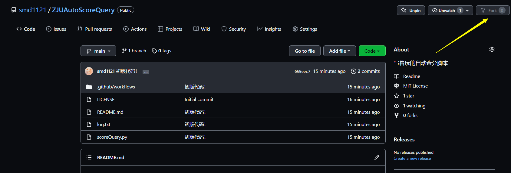

请删除其中原有的 log.txt，否则代码会将其当做你的上一次结果进行比对（当然也不是不行）。

### 2 生成一个 GitHub Token

在 [Personal access tokens (github.com)](https://github.com/settings/tokens) 中 Generate 一个 new token，这是保存上次查询结果的需要：

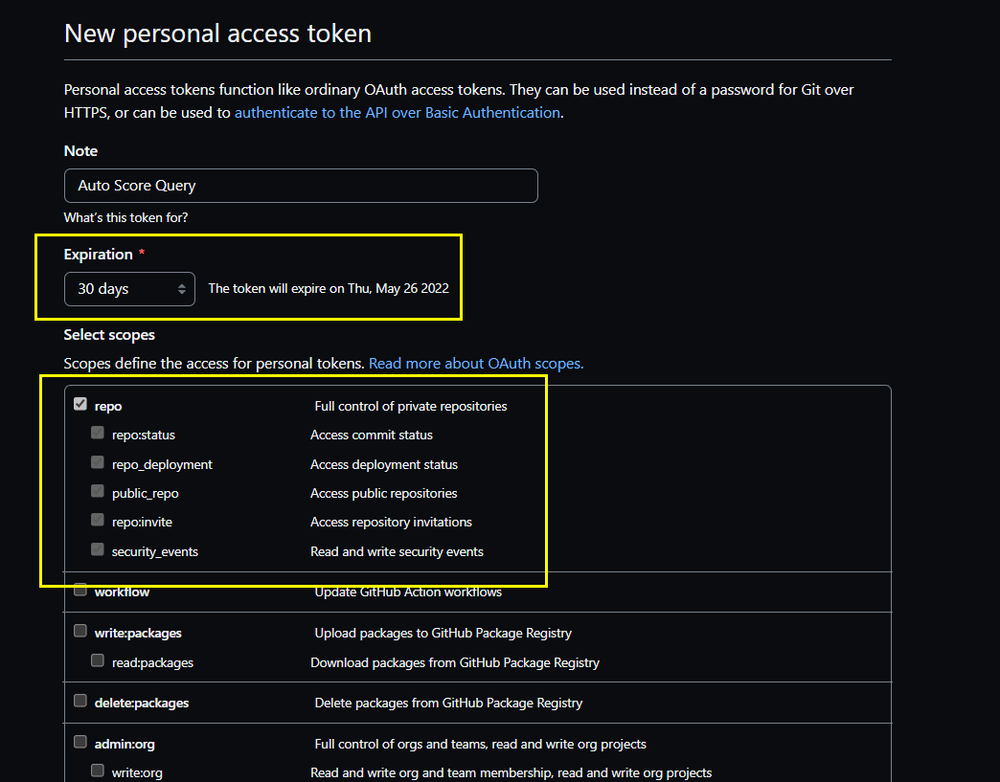

请注意这个 token 的有效期，在有效期结束后记得重新弄一个（当然也可以永久生效）！Select scopes 只需要勾选框住的部分即可QWQ

### 3 配置一个发件邮箱

SMTP 是发送电子邮件的协议，代码需要发送信箱的授权密码从而进行发件。

请找一个邮箱，然后配置其自动发送功能。以 136 邮箱为例：

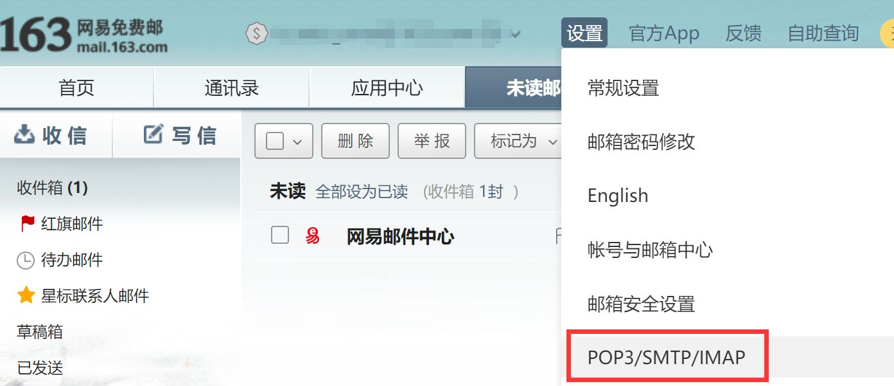

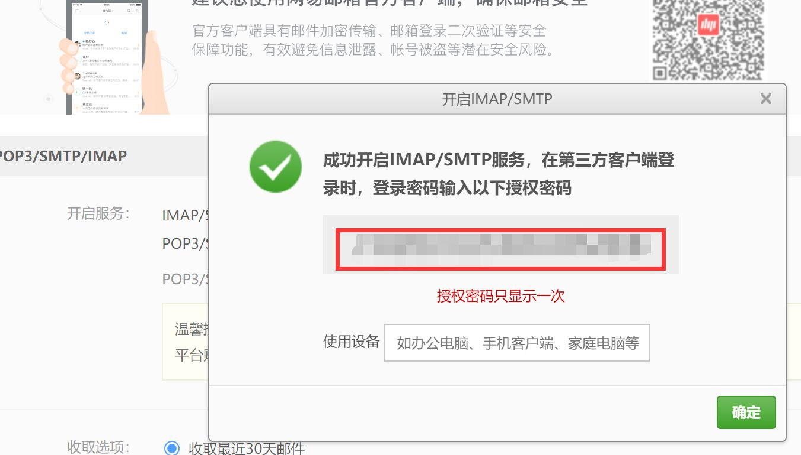

开启 IMAP/SMTP 或者 POP3/SMTP 服务，记录下这个授权密码。

然后，找到使用的邮箱的 SMTP 服务器地址（百度也可以）：

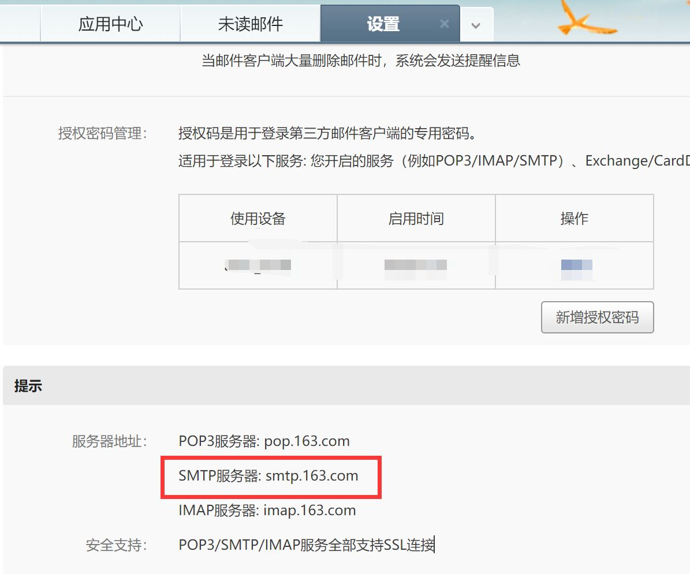

QQ 邮箱的话也是类似的操作，在 设置 - 账户 中开启后记住授权密码，并找到 SMTP 服务器信息即可：

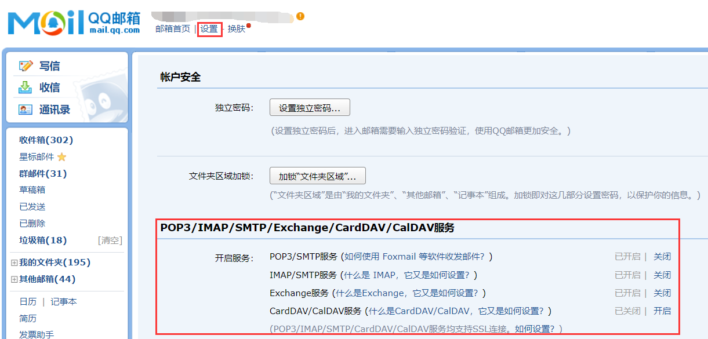

### 4 设置 Actions Secrets

在你 fork 出的仓库的 Setting - Secrets - Actions 中新建 secret：

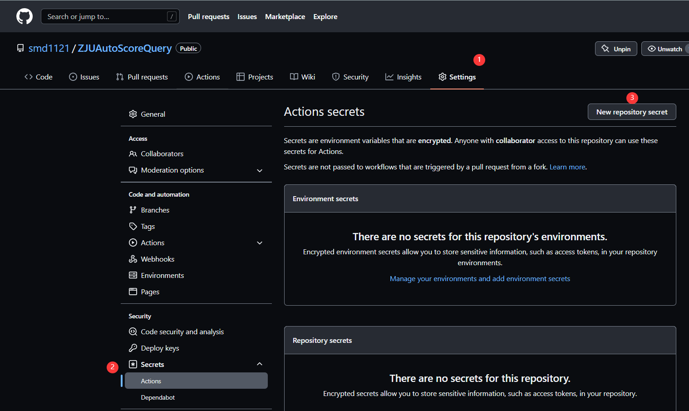

总共需要如下 7 个 Secret（名字需要完全相同），分别表示：

* `ACCOUNT` 和 `PASSWORD`：你的学号和统一身份认证密码
* `TOKEN`：第 2 步配置的 GitHub Token
* `MAILFROM` , `KEY ` 和 `HOST`：第 3 步配置的发件邮箱地址、授权密码和对应邮箱的 SMTP 服务器
* `MAILTO`：收件邮箱地址，可以和之前那个一样

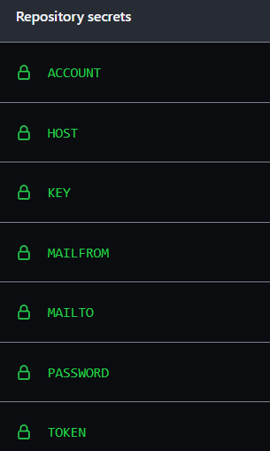

### 5 Enable Actions

点到这里来！首先这里会让你 Enable 这个 Repo 的 Workflow：

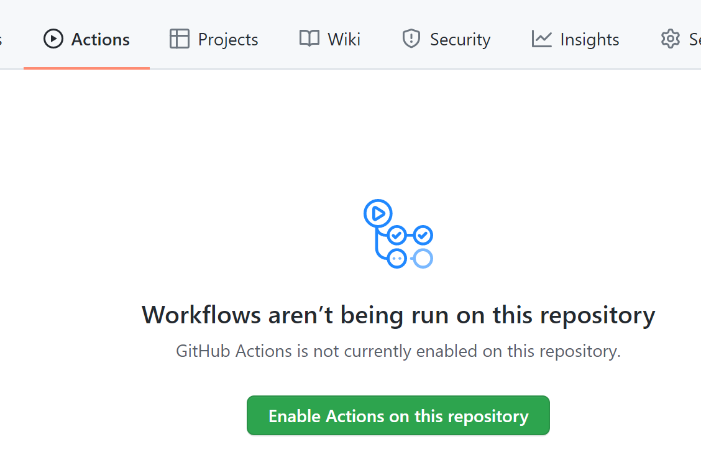

然后还需要点到左边 Workflows 下面的 ScoreQuery，点进去以后再 Enable 一遍：

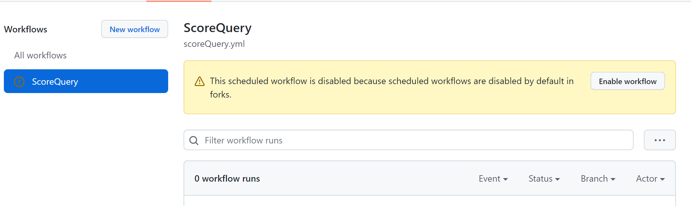

### 6 好啦！

点击你自己仓库的 star（取消然后重新点也可以）就会触发一次操作。每 10 分钟也会自动进行一次查询。你可以在 Actions 中查看是否成功：

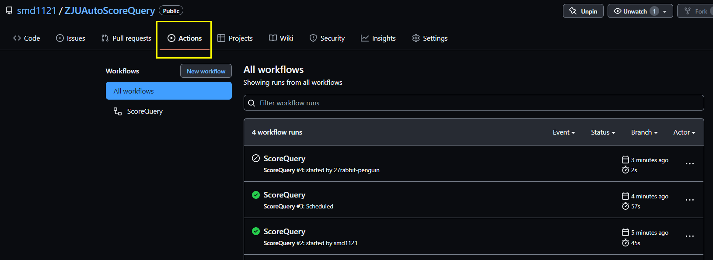

### References

除了文首参考的 [ZJU-Clock-In 自动打卡脚本](https://github.com/furry-potato-maker/ZJU-Clock-In) 以外，本工作的代码还部分参考自以下资料：

* https://stackoverflow.com/questions/51657000/how-to-convert-an-html-table-into-a-python-dictionary
* https://github.community/t/how-to-make-a-workflow-file-to-save-the-output-as-a-file-to-my-github-repo/18352/2
* https://stackoverflow.com/questions/27522626/hash-function-in-python-3-3-returns-different-results-between-sessions